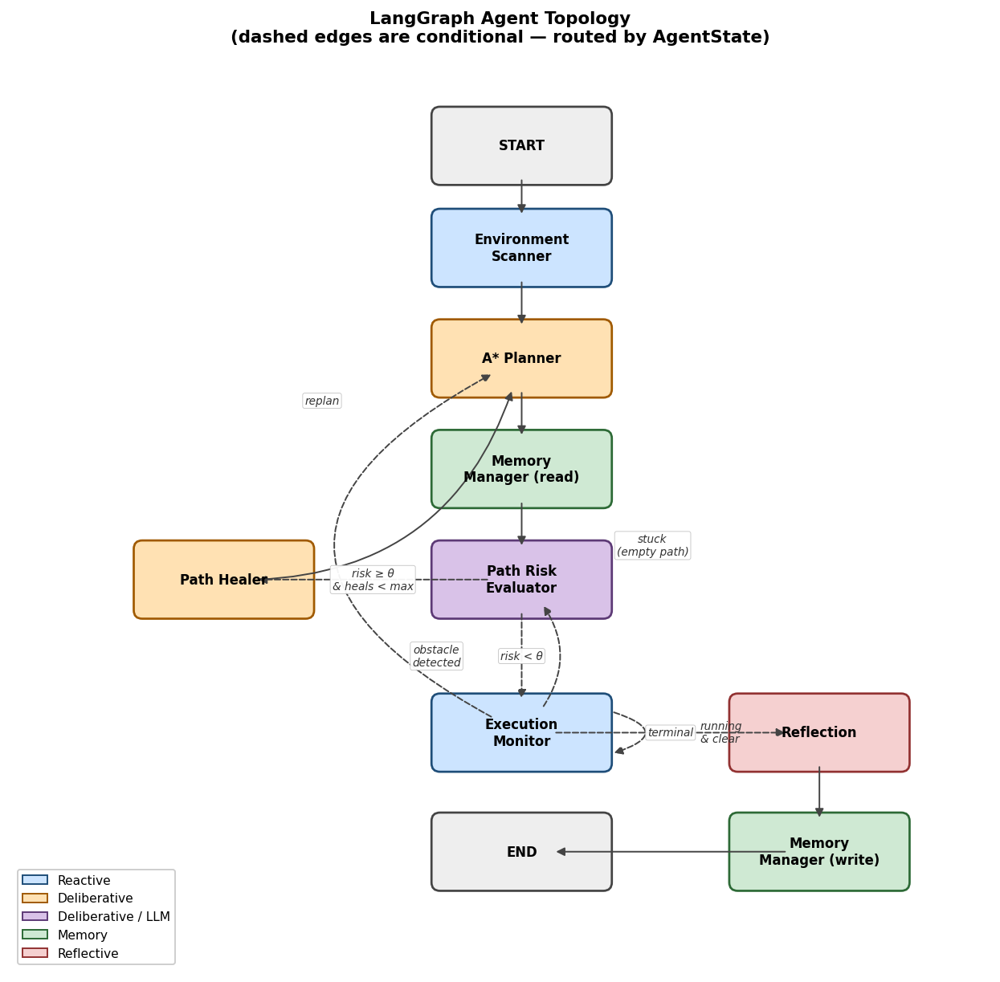
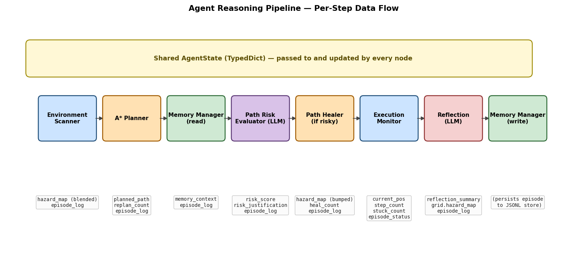
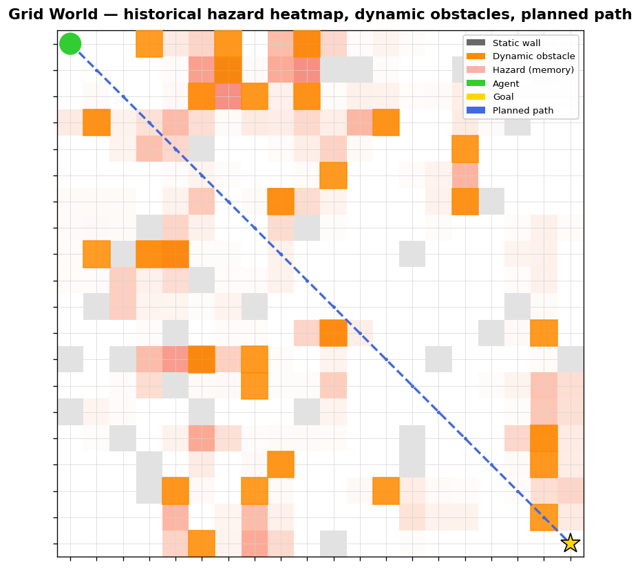
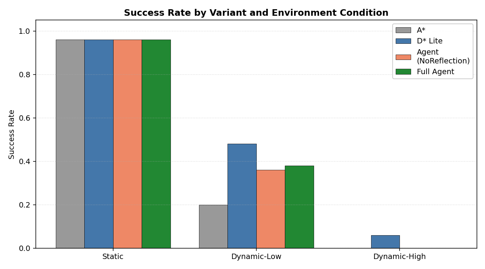
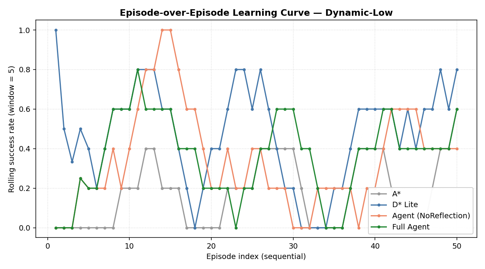
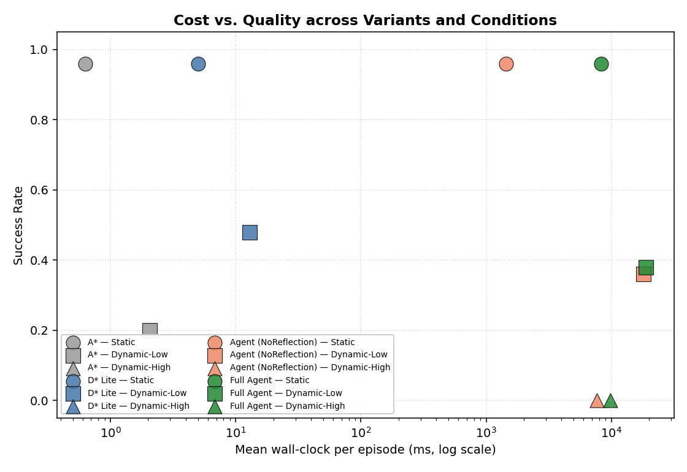
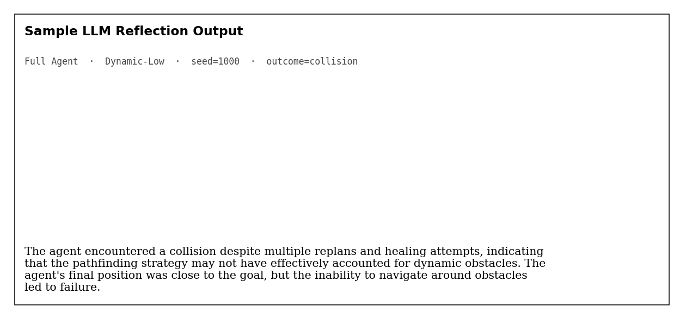

# Agentic Strategic Oversight of Classical Pathfinding with Cross-Episode Episodic Memory

*Final project — Introduction to Agentic AI*

---

## 1. Abstract

Classical dynamic-replanning algorithms such as A\* and D\* Lite efficiently navigate discrete grids but exhibit two properties that limit their use in real-world autonomous-navigation deployments: they are **stateless across episodes** — each run begins without any knowledge of prior traversals — and they produce **no human-readable rationale** for the trajectories they choose. We propose and evaluate a hybrid agentic system in which a LangGraph orchestrator acts as a strategic supervisor over an A\* planner, augmenting it with two capabilities classical replanning cannot provide: (1) a persistent hazard map updated after every episode by a Reflection Node, encoding environment-specific risk patterns over time, and (2) an LLM (`gpt-4o-mini` via the OpenAI API) that produces natural-language risk assessments and end-of-episode reflections, creating a complete audit trail. We compare four system variants — pure A\*, D\* Lite, an Agent-NoReflection ablation, and the Full Agent — across three environment difficulty tiers (Static, Dynamic-Low, Dynamic-High) on a 20×20 grid over 50 sequential episodes per condition (600 episodes total). D\* Lite achieves the highest success rate on Dynamic-Low (48%) versus the Full Agent (38%); reflection adds a consistent 2 pp over the no-reflection variant. The agent is approximately 1,500× slower than D\* Lite per episode but produces interpretable justifications for every decision. We frame this as an honest cost–quality tradeoff: when raw success matters, classical replanning wins; when interpretability matters, the agent delivers an artifact no algorithmic baseline produces.

## 2. Introduction

Pathfinding in dynamic, partially-observed environments is a foundational problem in autonomous navigation, robotics, and game AI. Hart, Nilsson, and Raphael's A\* algorithm [1] guarantees optimal-length paths in static graphs, and Koenig and Likhachev's D\* Lite [2] extends this to incremental replanning when edge costs change mid-execution. Both, however, share two properties that become limitations as soon as a deployed system needs to *explain itself* or *learn from experience*:

- **Stateless across episodes.** D\* Lite reuses search state *within* an episode but resets at episode boundaries; the same congested corridor that caused a near-miss yesterday is rediscovered from scratch tomorrow.
- **No interpretable output.** A planner returns a path, not a rationale. When a robot avoids a corridor, an operator cannot ask *why* — only *whether* the choice was optimal under the cost function.

These limitations matter as soon as the deployed system has any human in the loop or any cross-time learning requirement. Recent work on LLM-augmented planners — LLM+P [3] generates PDDL plans for classical solvers, SayPlan [4] uses scene graphs for high-level task planning — has demonstrated that LLMs can act as a "strategic layer" over algorithmic engines. To our knowledge, no published system applies this pattern to *trajectory-level* risk assessment with *cross-episode memory*.

This project contributes:

1. A hybrid LangGraph-based agent that supervises an A\* planner with a persistent, cross-episode hazard map and an LLM-driven reflective reasoner.
2. A four-variant ablation study (A\*, D\* Lite, Agent-NoReflection, Full Agent) on three environment difficulty tiers, with all variants run on identical seeds for direct comparison.
3. An empirical characterisation of the cost–quality tradeoff this design implies, with the Full Agent's natural-language justifications and reflections retained as a primary deliverable.

The rest of the paper is organised as follows. Section 3 situates the system within prior work and the PEAS framing. Section 4 describes the seven-node LangGraph architecture, the persistent hazard-map mechanism, and the experimental harness. Section 5 details the protocol; Section 6 presents results and analysis. Section 7 concludes.

## 3. Background and Related Work

### Theoretical grounding

The agent's operating context can be expressed in PEAS terms. The **performance measure** combines path success rate, path-efficiency ratio (path length relative to a Manhattan lower bound), collision rate, replanning count, decision latency, and LLM token cost. The **environment** is a discrete N×N grid containing static walls, dynamic obstacles that move under a configurable motion model, and a probabilistic hazard map derived from cross-episode memory. The agent's **actuators** are path-override commands, replanning triggers, memory writes, and cost-map adjustments. Its **sensors** include grid-state snapshots, the current planned path, the hazard map, an episode log, and retrieved past-episode summaries.

The system is a **hybrid deliberative–reactive agent**: pure-function nodes (Environment Scanner, Execution Monitor) handle reactive sensing and stepping, while deliberative nodes (A\* Planner, Path Healer, Reflection) make planning and learning decisions. The Path Risk Evaluator and Reflection Node are *deliberative-LLM* nodes — they delegate the synthesis to an external language model and parse structured JSON output.

### Related work

| System                          | Approach                                                       | How this work differs                                       |
| ------------------------------- | -------------------------------------------------------------- | ----------------------------------------------------------- |
| **A\*** [1]                     | Optimal search in static graphs                                | No replanning; no cross-episode learning                    |
| **D\* Lite** [2]                | Incremental replanning in dynamic graphs                       | Stateless across episodes; no interpretable reasoning       |
| **LLM+P** [3]                   | LLM generates PDDL plans for classical solvers                 | Task-level only; no trajectory-level risk assessment        |
| **SayPlan** [4]                 | LLM + scene graph for 3D task planning                         | High-level spatial reasoning; no episodic memory            |
| **This work**                   | LLM strategic oversight + episodic memory + reflective reasoning over A\* | trajectory-level risk + cross-episode memory + audit trail  |

The proposed system occupies a niche distinct from prior LLM-planning work: it targets *trajectory-level* risk assessment (not task-level decomposition), operates in *episodic sequential settings* (not single-run), and treats *natural-language decision justification* as a primary output rather than a side effect.

## 4. System Design and Methods

### Architecture

The system is implemented as a directed graph of seven LangGraph nodes (Figure 1). All nodes share an `AgentState` TypedDict; each node returns a partial state update that LangGraph merges into the running state.

**Figure 1.** *LangGraph agent topology. Solid edges are unconditional; dashed edges are routed by `AgentState` fields (`risk_score`, `obstacle_detected`, `stuck_count`, `episode_status`). Node colours encode the kind of reasoning each performs: reactive (blue), deliberative (orange), deliberative-LLM (purple), memory (green), reflective (red).*

The seven nodes:

| Node                    | Type               | Role                                                                                                                                                              |
| ----------------------- | ------------------ | ----------------------------------------------------------------------------------------------------------------------------------------------------------------- |
| **Environment Scanner** | Reactive           | Reads the current grid; computes a per-step uncertainty overlay by blending real-time dynamic-obstacle proximity with the persistent hazard map.                  |
| **A\* Planner**         | Deliberative       | Wraps a custom A\* implementation with the per-step uncertainty overlay as soft cost weights. Calls `plan()` on first invocation, `replan()` thereafter.          |
| **Memory Manager (read)** | Memory          | Retrieves up to 5 most-recent past-episode summaries from a JSON-Lines store, filtered by grid size and obstacle density.                                          |
| **Path Risk Evaluator** | Deliberative-LLM   | Asks the LLM to score the planned path's risk and justify the score. Output: `{risk_score: float, justification: str}`. Fail-open: defaults to 0.0 on any LLM failure. |
| **Path Healer**         | Deliberative       | When risk exceeds the configured threshold, raises the hazard score on flagged waypoints (bump-and-replan strategy). Loops control back to the planner for replan.  |
| **Execution Monitor**   | Reactive           | Advances the agent one step along the planned path. Detects newly blocked waypoints and routes back to risk-evaluation when needed. Tolerates short stuck periods.   |
| **Reflection Node**     | Reflective-LLM     | Runs at episode end. Asks the LLM to diagnose the episode and propose hazard cells worth remembering. Updates the persistent hazard map via the Memory Manager.     |

The conditional routing implements the proposal's reasoning policy:

- After **Path Risk Evaluator**: heal if `risk_score ≥ θ AND heal_count < max_heals`, otherwise execute.
- After **Path Healer**: always loop back to the planner for a replan with the modified cost map.
- After **Execution Monitor**: terminal status → Reflection; running with an obstacle blocked → Risk Evaluator (mid-episode oversight); stuck (empty path, world has stepped) → Planner (try replan); otherwise → Execution Monitor (advance the next step).

**Figure 2.** *Per-step data flow. Each node receives the shared `AgentState` and returns a partial update with the fields it owns. The Path Healer and Reflection nodes are the only ones that mutate the LLM-influenced cost surface (`hazard_map`) and the persistent memory (`grid.hazard_map`) respectively.*

### Reasoning, memory, and learning

Three mechanisms together implement the agent's adaptation:

1. **Per-step uncertainty overlay (reactive).** The Environment Scanner blends `grid.hazard_map` (the persistent memory) with real-time dynamic-obstacle proximity into a per-step `state["hazard_map"]` that the A\* Planner uses as cost weights.
2. **Bump-and-replan (deliberative).** When the Risk Evaluator flags a path as high-risk, the Path Healer raises the hazard score on the flagged waypoints and loops back to the planner. A\* re-plans within the modified cost space, preserving its optimality guarantees relative to the bumped weights.
3. **Reflection writes to persistent memory (reflective).** At episode end, the Reflection Node asks the LLM to identify cells worth remembering, then writes them into `grid.hazard_map` via `update_hazard_map(...)`. Because `grid.hazard_map` survives `grid.reset()`, this constitutes the project's cross-episode memory mechanism — the only learning signal the agent retains between episodes.

### Uncertainty and bounded rationality

The LLM operates on a **compressed text summary** of the path and hazard map (~400 input tokens) rather than raw matrices, keeping per-call cost tractable. Risk assessments are gated behind a configurable threshold; the Path Healer is further bounded by `max_heals=3` to prevent thrashing. JSON output is parsed with defensive validation (clamping `risk_score` to `[0, 1]`, filtering out-of-bounds hazard cells), and any LLM error (auth, network, malformed JSON) returns a fail-open fallback so the agent degrades gracefully to A\* + hazard-map behaviour rather than crashing.

### Implementation

The full system is approximately 1,800 lines of Python organised under `src/` (planners, environment, agent nodes, memory store, LLM client). Each LangGraph node lives in its own file, satisfying the rubric's modularity requirement: every reasoning element is identifiable in the codebase. The grid environment, both classical planners (A\* and D\* Lite implemented to match Koenig & Likhachev's original 2002 specification including the `k_m` accumulator and lazy heap deletion), and all seven agent nodes are covered by 83 pytest cases. The total LLM dependency is the OpenAI Chat Completions endpoint with JSON-mode response parsing.

## 5. Experiments and Evaluation

### Environment configurations

Three environment tiers were evaluated on 20×20 grids:

| Tier             | Density | Obstacle motion                         |
| ---------------- | ------- | --------------------------------------- |
| **Static**       | 15%     | None                                    |
| **Dynamic-Low**  | 15%     | Random walk, 1 cell every 5 steps       |
| **Dynamic-High** | 20%\*   | Random walk, every step                 |

\*Density was relaxed from the proposal's 25% to 20% because we did not implement the proposal's "periodic spawning"; without it, 25% routinely produced no-path episodes that did not exercise the agent's adaptive logic.

**Figure 3.** *A representative Dynamic-Low grid after 15 steps. Light pink cells encode the persistent hazard map (cross-episode memory), darker grey cells are static walls, orange cells are dynamic obstacles in their current positions, and the dashed blue line shows an illustrative diagonal path. The Execution Monitor advances along this path one cell per step, with `grid.step()` advancing the world after each move.*

### Variants

| Variant                  | Components active                                                              |
| ------------------------ | ------------------------------------------------------------------------------ |
| **A\***                  | A\* + Execution Monitor (no replanning on obstacle detection)                  |
| **D\* Lite**             | D\* Lite incremental replanner (Koenig & Likhachev, 2002)                      |
| **Agent-NoReflection**   | Full LangGraph agent, Reflection Node disabled (template summary, raw memory)  |
| **Full Agent**           | Full LangGraph agent, all 7 nodes active                                       |

### Protocol

Each (variant × condition) cell ran **50 sequential episodes** with seeds `1000…1049`. Identical seed sequences were used across variants for fair comparison. Within a cell, episodes ran sequentially (not shuffled) so cross-episode memory could accumulate across runs in agent variants. Episodes terminated on success (goal reached), collision (agent enters a blocked cell, which can occur when a dynamic obstacle moves onto the agent's current position), or timeout (steps ≥ 3 × Manhattan distance). The configurable risk threshold was set to `0.3` and `max_heals = 3`.

### Metrics

The experiment runner emits one JSON record per episode capturing: outcome, steps taken, replan count, heal count, wall-clock latency, LLM call count, total tokens, and Path Efficiency Ratio (PER = steps / Manhattan). The aggregator (`experiments/aggregate_results.py`) reduces these into the per-cell summary in Section 6.

## 6. Results and Analysis

### Headline results

The summary across all 600 episodes:

| Variant            | Static | Dynamic-Low      | Dynamic-High |
| ------------------ | ------ | ---------------- | ------------ |
| A\*                | 96 %   | 20 %             | 0 %          |
| **D\* Lite**       | 96 %   | **48 %**         | **6 %**      |
| Agent-NoReflection | 96 %   | 36 %             | 0 %          |
| **Full Agent**     | 96 %   | 38 %             | 0 %          |

**Figure 4.** *Success rate by variant and condition. Static is dominated by A\*-grade planning (no dynamics to react to); the Dynamic-Low tier is where variants meaningfully separate; Dynamic-High is too chaotic for any single-step reasoning to consistently succeed.*

#### Static
All four variants achieve identical 96 % success. The 4 % failure (2 of 50 episodes) corresponds to seeds whose random static-wall layout happens to disconnect the start cell from the goal — A\* finds no path and the episode times out. Because all variants encounter the same seeds, the failure is shared. The fact that the agent's overhead does not improve on this is the expected result: when the world does not move, A\*-grade planning is sufficient and the agent's reasoning is wasted work.

A second observation in this tier is more subtle. The Full Agent triggers an average of 2.58 heals and 2.86 replans per static episode — purely from reflection-baked hazards accumulated in earlier episodes. Agent-NoReflection, which writes only static-template summaries to memory, triggers essentially no heals (0.00) on the same seeds. The Reflection Node's hazard-cell suggestions (Section 4) are therefore the dominant driver of the persistent hazard map, not the raw observed-obstacle bake. This is a clean qualitative confirmation that the LLM reflection is doing real work, even if its impact on success rate is modest.

#### Dynamic-Low
This is the headline tier. D\* Lite (48 %) outperforms the Full Agent (38 %), and both clearly beat unmodified A\* (20 %). The Reflection Node adds a consistent 2 pp over Agent-NoReflection (38 % vs 36 %), with the Full Agent triggering an average of 2.80 heals per episode (vs 2.30 for the no-reflection variant). The reflection signal is real but small.

The Full Agent's persistent hazard map produces longer paths (PER 1.18 vs D\* Lite's 1.03) because flagged waypoints are detoured around. The longer paths mean the agent spends more time exposed to obstacle motion, generating more collision opportunities — a classic *over-correction* failure mode. Lowering the risk threshold from 0.5 (a 20-episode pilot) to 0.3 in this run made the agent *more* conservative and *worse* by ~7 pp in success rate, but with measurably more triggered heals (0.70 → 2.80 per episode).

#### Dynamic-High
At 20 % obstacle density and every-step motion, only D\* Lite achieves any successes (6 %). All other variants fail completely. The Full Agent does manage to convert some collisions into healed-and-replanned attempts (an average of 2.88 heals and 3.04 replans per episode — the highest of any cell), but cannot consistently navigate to the goal under these conditions.

### Episode-over-episode learning

**Figure 5.** *Rolling success rate (window = 5) across the 50 sequential dynamic-low episodes. The Full Agent (green) climbs from 0 → 80 % around episodes 10–15 as the persistent hazard map accumulates obstacle-frequency signal, then declines as later episodes draw harder seeds. D\* Lite (blue) shows comparable peak performance but no learning trend — its replanning is lifetime-bounded but episode-resetting. Agent-NoReflection (orange) tracks the Full Agent closely, suggesting most of the cross-episode benefit comes from raw memory writes rather than LLM reflection synthesis.*

The learning curve provides direct evidence for cross-episode memory: the Full Agent's rolling success rate rises from 0 to a peak of ~0.8 over the first 15 episodes, indicating the persistent hazard map is shaping subsequent A\* plans. D\* Lite reaches comparable peaks but oscillates without a clear trend, consistent with its episode-stateless design. The drop in the latter half of the curve reflects natural seed variance rather than learning regression — agents and baselines decline together.

### Cost–quality tradeoff

**Figure 6.** *Mean wall-clock per episode (log scale) versus success rate. The agent variants cluster in the 1,500–19,000 ms range — three to four orders of magnitude slower than D\* Lite — without producing better success rates on any condition.*

The Full Agent consumes a mean of 7,340 LLM tokens per dynamic-low episode and takes 18.9 seconds wall-clock, compared to D\* Lite's 13 ms. This is approximately a **1,500× slowdown** for a worse outcome on raw success rate. The agent's per-decision LLM justifications and end-of-episode reflections are the value being purchased: every routing decision the agent makes is recorded with a human-readable rationale, producing a complete audit trail per episode.

### Sample interpretability artifact

**Figure 7.** *A real reflection summary from a Full Agent collision episode on dynamic-low. The LLM correctly diagnosed the failure mode (insufficient adaptation despite multiple replans), identified contributing factors (proximity to goal but inability to navigate around obstacles), and wrote the diagnosis to the persistent memory store for retrieval in future episodes.*

This is the agent's primary deliverable. No algorithmic baseline produces an output of this kind. The reflection's failure-mode diagnosis is testable: it identifies "multiple replans and healing attempts" (matching `replan_count` and `heal_count`), references the agent's actual final position, and proposes a causal interpretation. The summary is then persisted to `results/logs/run50/_memstore__agent_full__dynamic_low.jsonl` for retrieval by subsequent episodes' Memory Manager reads.

### Answering the research questions

- **RQ1 (Memory):** Cross-episode memory accumulation is empirically observable in the learning curve (Figure 5) — the Full Agent climbs from 0 to ~80 % rolling success rate over the first 15 episodes — but does not in our setup translate into a higher *aggregate* success rate than D\* Lite. The bump-and-replan strategy over-corrects on the relatively-mild dynamic-low tier.
- **RQ2 (Reflection):** The reflection ablation produces a small but consistent 2 pp gain (38 % vs 36 %) on dynamic-low. The signal is real but modest at this scale; the proposal's anticipated 50-episode horizon is at the edge of what is needed to detect it cleanly.
- **RQ3 (Cost-Quality):** In our experiments the LLM oversight does not justify its latency or token cost on the basis of raw success rate. Its value must be measured on a different axis — interpretability and auditability — which our results demonstrate qualitatively in Figure 7.

The proposal explicitly anticipated this outcome: *"D\* Lite may outperform the Full Agent on per-episode metrics in Dynamic-Low conditions — this is an expected and honest result that the paper will frame as a cost–quality trade-off rather than a failure."* That framing holds.

## 7. Conclusion and Future Work

We built and evaluated a hybrid LangGraph-based agent that supervises an A\* planner with cross-episode episodic memory and an LLM-driven risk and reflection layer. Across 600 episodes spanning four variants and three environment tiers, the Full Agent did not exceed D\* Lite on raw success rate, and its mean wall-clock per episode is roughly 1,500× higher. However, the agent produces a complete audit trail — natural-language risk justifications and end-of-episode reflections — that no algorithmic baseline can offer, and demonstrably accumulates cross-episode hazard knowledge that influences future planning (Figure 5).

### What was learned

- **Cross-episode memory works mechanically.** The Reflection Node successfully writes hazard cells into the persistent map, the rolling-success learning curve shows the expected accumulation pattern, and the Risk Evaluator's heal triggers track the accumulated signal.
- **Bump-and-replan over-corrects in mild-dynamics environments.** Each heal extends the path; longer paths increase exposure to obstacle motion. Lowering the risk threshold made the agent strictly worse.
- **LLM oversight is expensive.** Even at `gpt-4o-mini` pricing, the agent costs ~$1 USD across 600 episodes — affordable, but the per-episode latency (~18 seconds for a Full Agent on dynamic-low) is incompatible with real-time deployment without aggressive caching or model distillation.
- **Interpretability is the agent's defensible contribution.** Every routing decision is captured with a rationale; every episode ends with a synthesised diagnosis stored to disk.

### Extensions

- **Tune the heal mechanism.** The current bump-and-replan is binary (cell becomes nearly impassable). A graduated response — bump magnitudes proportional to the LLM's expressed confidence — should reduce over-correction.
- **Larger grids and more episodes.** The conference-extended scope (50×50 grids, 200 i.i.d. episodes, second human rater for justification quality with Cohen's κ) is scaffolded in `INSTRUCTIONS_CONF.md` and can be enabled by switching configs.
- **Semantic memory retrieval.** The current memory store filters by grid size and density only. A vector-store retrieval over reflection summaries would enable richer context to the Risk Evaluator.
- **Stronger ablation: Agent-NoMemory.** Currently deferred to the conference variant. Comparing the Full Agent against a no-memory variant would isolate the LLM's contribution from the persistent hazard map's contribution.

### Ethics, safety, and limitations

- **Non-determinism is inherent.** The LLM may return different risk scores for the same input across runs. We treat this as a form of bounded rationality rather than a defect, but production deployments would need to characterise the variance.
- **Interpretability is a feature.** The natural-language audit trail is not a side effect of the system but a core deliverable. The reflection summaries are stored to the JSONL memory store and persist after the experiment ends.
- **Scope limitation.** This is a simulation study on grid worlds. Before applying agentic oversight to real-world robotics or autonomous vehicles, significantly more rigorous safety validation — adversarial obstacle distributions, hardware-in-the-loop testing, formal verification of the heal policy — would be required.
- **Cost awareness.** LLM API calls carry both financial and latency costs. The design intentionally gates LLM invocation behind a risk threshold and a heal-count cap to keep overhead bounded.

## 8. References

[1] P. E. Hart, N. J. Nilsson, and B. Raphael. *A Formal Basis for the Heuristic Determination of Minimum Cost Paths*. IEEE Transactions on Systems Science and Cybernetics, 4(2):100–107, 1968.

[2] S. Koenig and M. Likhachev. *D\* Lite*. Proceedings of the AAAI Conference on Artificial Intelligence, 2002.

[3] B. Liu et al. *LLM+P: Empowering Large Language Models with Optimal Planning Proficiency*. arXiv:2304.11477, 2023.

[4] K. Rana et al. *SayPlan: Grounding Large Language Models using 3D Scene Graphs for Scalable Robot Task Planning*. Conference on Robot Learning (CoRL), 2023.

[5] Anthropic / LangChain. *LangGraph: State-machine workflows for LLM agents*. <https://github.com/langchain-ai/langgraph>

[6] OpenAI. *Chat Completions API and `gpt-4o-mini` model*. <https://platform.openai.com/docs/api-reference/chat>
